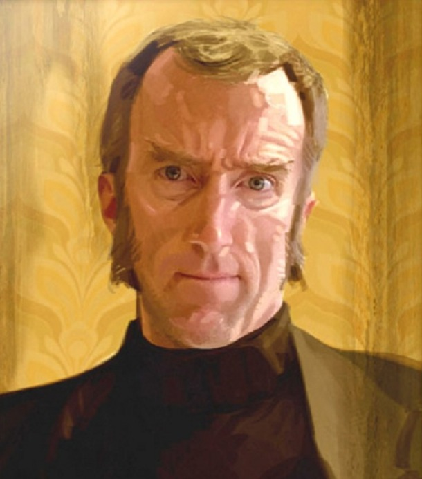

 # _Good job aspirant!_
## Cave Johnson here!
First I'd like to congratulate you for getting so far and of course for wanting to be part of the future.
Our cryptography department have developed this great tool just for you.
Just wait for our encrypted message to use it. It's not that hard.
If you decide to participate in our tests, please follow the instructions.

  

>“Science isn't about WHY, it's about WHY NOT!”

------------------
## :computer:The girl behind the code :computer:

 Hello  there fellow netizens this is my first project for <>laboratoria</>, it ain't that much but I'm very proud of it.
 Portal is one of my favorite videogames ever and I decided to make a cipher based on the game premise/theme where the tests subjects need to decode an encrypted message to go into the tests chambers not knowing the cake is a lie.
